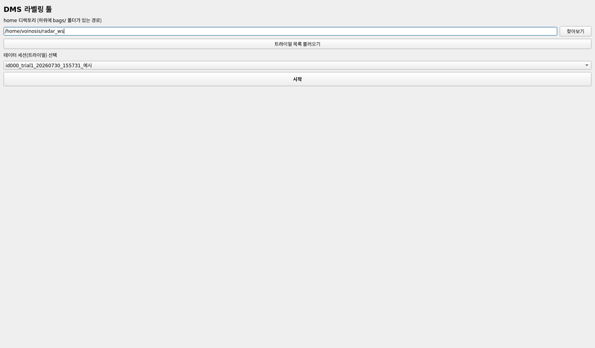
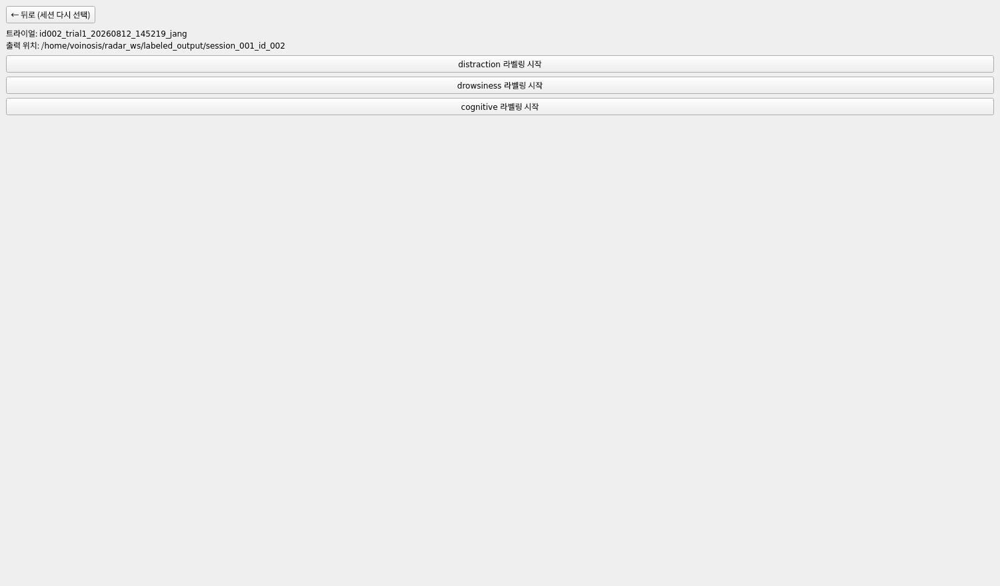
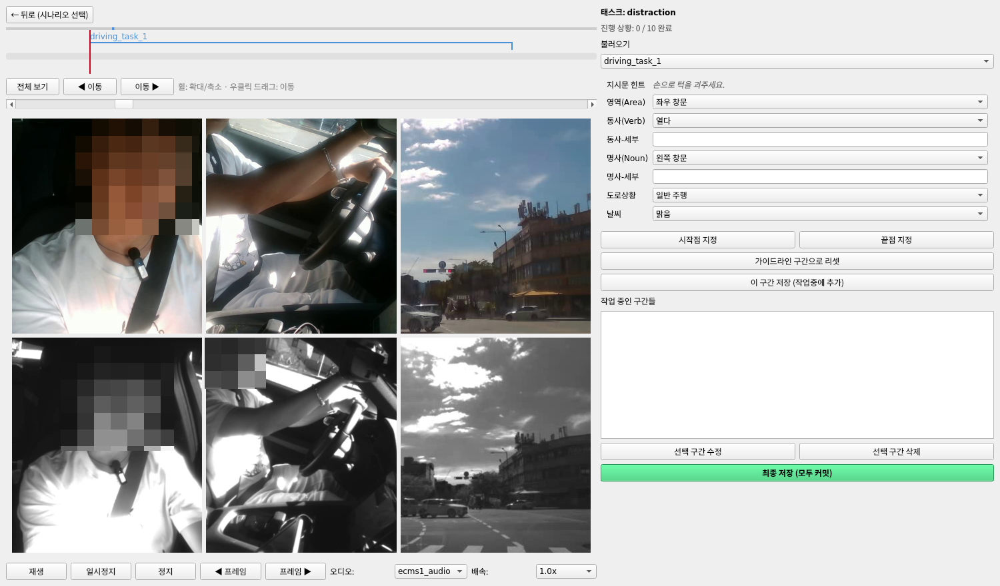
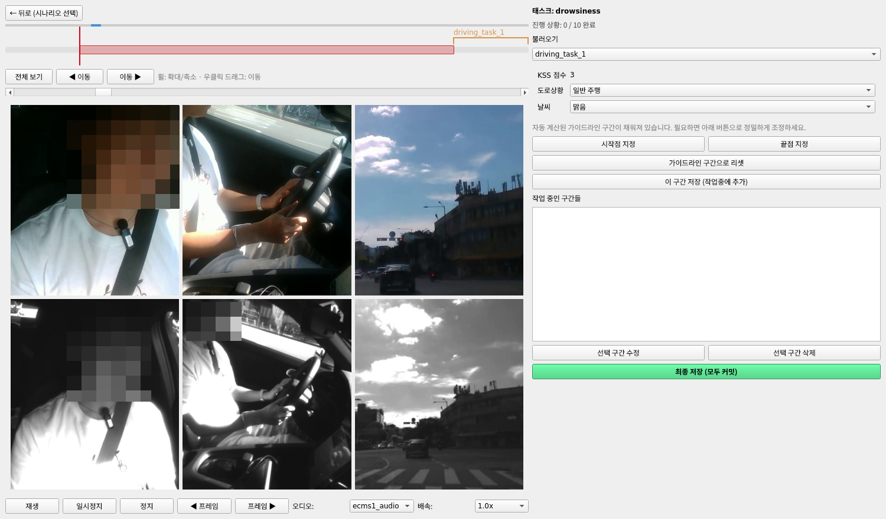
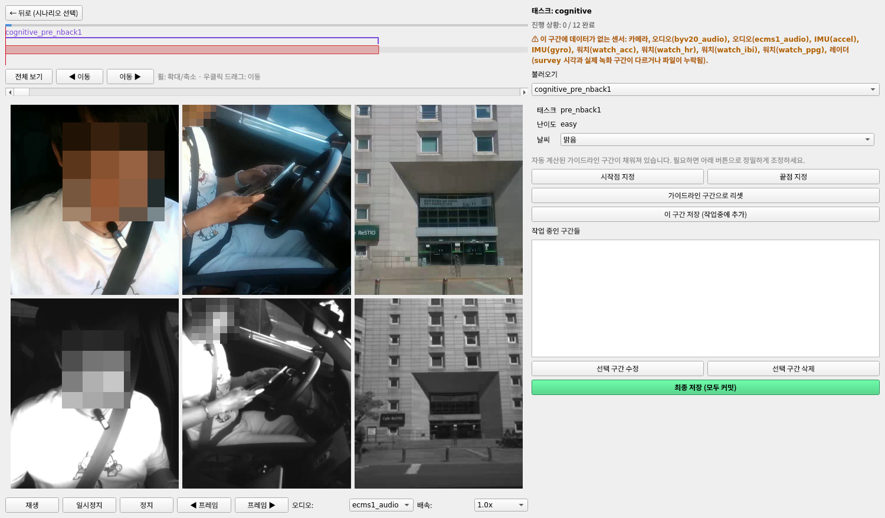

# DMS 라벨링 툴 사용법

프로그램을 실행한 뒤 세션을 열고, 라벨을 붙이고, 최종 저장까지 하는 전체
흐름을 순서대로 설명합니다. 설치/실행 자체는 설치_안내.md를 참고하세요.

## 1. 세션 선택 화면

프로그램을 실행하면 가장 먼저 나오는 화면입니다.

1. **홈 디렉토리 선택**: 입력창에 직접 경로를 쓰거나 찾아보기 버튼으로
   폴더를 고릅니다. 이 폴더 **바로 아래에 bags 폴더가 있어야** 합니다
   (<홈 디렉토리>/bags/<트라이얼 폴더>/... 구조).
2. **트라이얼 목록 불러오기** 버튼을 눌러 그 안의 트라이얼(세션) 목록을
   불러옵니다. 목록이 비어있으면 bags 폴더 경로가 화면에 표시되니,
   실제로 그 위치에 데이터가 있는지 확인합니다.
3. 콤보박스에서 라벨링할 트라이얼을 고르고 **시작**을 누릅니다.

## 2. 시나리오 선택 화면

세션을 열면 distraction(주의분산) / drowsiness(졸음) /
cognitive(인지) 세 시나리오 중 하나를 고르는 화면이 나옵니다.

- 시나리오 버튼을 누르면 데이터를 준비하는 동안 버튼들이 잠깁니다(화면이
  안 넘어간다고 여러 번 누르지 않아도 됩니다 - 준비가 끝나면 자동으로
  라벨링 화면으로 넘어갑니다).
- 한 번 열었던 시나리오는 다시 계산하지 않고 그대로 이어서 보여줍니다.
- 뒤로 가기를 누르면 이 화면으로 돌아오고, 재생 중이던 영상/음성은
  자동으로 멈춥니다.

## 3. 라벨링 화면 구성

화면은 좌우로 나뉩니다.

**왼쪽**: 타임라인(전체 구간을 가로 막대로 표시) + 6분할 영상(운전자/
행동/도로 카메라 × RGB/적외선) + 재생 컨트롤(재생/일시정지/정지, 프레임
이동, 마이크 선택, 배속).

**오른쪽**: 시나리오 이름, (데이터가 없으면) 경고 배너, 진행 상황,
task 선택 콤보박스, 라벨 입력 폼, 시작/끝점 지정 버튼, 구간 저장 버튼,
작업 중인 구간들 목록, 최종 저장 버튼.

### 재생/탐색 조작

| 동작 | 방법 |
|---|---|
| 재생/일시정지 | 스페이스바 또는 재생 버튼 |
| 1초 이동 | ←/→ |
| 프레임 단위 이동 | Shift+←/→ (꾹 누르면 연속 이동) |
| 특정 지점으로 이동 | 타임라인 클릭 |
| 타임라인 확대/축소 | 마우스 휠 |
| 타임라인 이동(확대된 상태에서) | 우클릭 드래그, 또는 ◀ 이동/이동 ▶ 버튼 |
| 재생 속도 변경 | 배속 콤보박스(0.25x~2.0x) |
| 재생할 마이크 변경 | 마이크 선택 콤보박스 |

## 4. 시나리오별 라벨링 방법

세 시나리오는 **구간을 어떻게 정하는지**가 다릅니다.

### distraction — 구간을 직접 정의

영역(Area)/동사(Verb)/명사(Noun) 드롭다운 목록은 DMS_Actions.xlsx
파일에서 읽어옵니다. 이 파일이 실행 파일(또는 run_app.py)과 같은
폴더에 없으면 목록이 채워지지 않고 **기타만 있는 상태**로 뜹니다 -
이 경우 라벨링 자체는 계속할 수 있지만(직접 타이핑), 정해진 목록에서
고르지는 못합니다. 화면에 뭔가 이상하게 비어있다 싶으면 이 파일부터
확인하세요.

1. 오른쪽 콤보박스에서 task를 선택하면, 그 task의 지시문 힌트(예: 왼쪽
   사이드미러를 조정하세요)가 폼 위쪽에 표시됩니다.
2. 영상을 재생하며 지시문에 해당하는 행동이 실제로 일어나는 구간을
   찾습니다.
3. 그 시작 지점에서 **시작점 지정**, 끝 지점에서 **끝점 지정**을
   누릅니다(현재 재생헤드 위치가 그대로 찍힙니다).
4. 라벨 폼을 채웁니다: **영역(Area)** 선택 → 그 영역에 맞는 **동사/명사**
   드롭다운이 자동으로 채워짐 → 필요하면 세부 내용 자유 서술, 도로상황,
   날씨. 목록에 맞는 항목이 없으면 기타를 선택하고 직접 입력합니다.
5. **구간 저장**을 누릅니다. 이미 저장된 구간과 겹치면 저장되지 않고
   안내가 뜹니다.
6. 지시문이 복합 동작이면(예: 열었다가 닫아주세요) **2~5번을 반복**해서
   여러 구간으로 나눠 저장합니다 - 서브구간 개수 제한은 없습니다.

영역/동사/명사 드롭다운은 처음엔 그냥 목록의 첫 항목이 기본으로 떠
있는 것뿐입니다(지시문 힌트를 보고 자동으로 맞춰주는 기능이 아닙니다) -
반드시 직접 영상을 보고 실제 상황에 맞는 값으로 바꿔야 합니다.

### drowsiness — 구간이 자동으로 잡힘 (미세 조정 가능)

1. task를 선택하면 시작/끝 지점이 **자동으로** 질문 시작 1분 전 ~ 질문
   시작으로 채워지고, 화면도 그 구간에 맞춰 확대됩니다. 이 기본값을
   따로 지정할 필요는 없습니다.
2. KSS 점수(설문에서 이미 받은 값)는 폼에 자동으로 표시됩니다 - 직접
   입력하는 항목이 아닙니다.
3. 필요하면 시작점 지정/끝점 지정으로 프레임 단위 미세 조정을 할 수
   있고, **가이드라인으로 리셋**을 누르면 자동 계산된 값으로 되돌아갑니다.
4. 도로상황/날씨를 채우고 **구간 저장**을 누릅니다.

### cognitive — 구간이 자동으로 잡힘 (미세 조정 가능)

drowsiness와 같은 방식입니다. task를 선택하면 그 태스크(pre_nback1
등)의 실제 시작~끝 구간이 자동으로 채워지고, 폼에는 태스크 종류와
난이도가 이미 표시됩니다(둘 다 읽기 전용). 날씨만 채우고 저장하면
됩니다.

위 스크린샷은 6번 항목(데이터 없음 경고)이 실제로 뜬 예시이기도 합니다
- 이 구간엔 카메라를 제외한 대부분의 센서 데이터가 없어서 경고가
표시됐습니다.

## 5. 작업 중인 구간들 목록

지금까지 저장한 구간이 여기 쌓입니다.

- 항목을 클릭하면 그 구간 시작으로 이동하고, 재생을 누르면 **그 구간
  끝에서 자동으로 멈춥니다**(내용 확인용 - 뒤에 이어지는 다른 구간까지
  계속 재생되지 않음). 타임라인을 직접 클릭하거나 다른 조작을 하면 이
  제한은 풀립니다.
- 아직 최종 저장 안 한 구간만 **수정/삭제**할 수 있습니다. 이미 최종
  저장된 구간은 [완료]로 표시되고 수정/삭제 버튼이 막힙니다(되돌리는
  방법은 7. 최종 저장 참고).
- 수정은 불러와서 폼에 채운 뒤, 값을 고쳐 다시 저장하는 방식입니다.

## 6. 데이터 없음 경고

특정 구간에 카메라/오디오/IMU/워치/레이더 중 데이터가 없는 센서가 있으면
화면에 경고 배너가 뜹니다. 무시하고 라벨링을 진행할 수는 있지만, 최종
저장 시 그 센서의 파일만 안 만들어지거나(완전히 없는 경우) 짧게
채워집니다(일부만 없는 경우).

## 7. 최종 저장

1. **구간 저장**(폼 아래 버튼)은 임시 저장입니다 - 언제든 수정/삭제
   가능하고, 아직 아무 파일도 잘리지 않습니다.
2. 라벨링할 구간을 전부 저장했으면 **최종 저장** 버튼을 누릅니다.
   확인 창이 한 번 뜹니다.
3. 저장 중에는 버튼에 저장 중... (n/전체구간) {처리 중인 항목}이
   표시되고, 이 동안에도 화면은 계속 반응합니다(멈춘 것처럼 보여도
   응답 없음이 뜨지 않음). 구간 하나당 몇 초~몇십 초 걸릴 수 있습니다
   (영상 재인코딩 때문).
4. 완료되면 결과 다이얼로그가 뜹니다. **최종 저장된 구간은 앱 화면
   안에서는 수정/삭제가 안 됩니다** - 구간 저장과 달리 실수로 다시
   고치는 걸 막기 위해 의도적으로 막아둔 것입니다.

결과물은 <홈 디렉토리>/labeled_output/session_{번호}_id_{피험자}/
{시나리오}/{구간이름}/ 폴더에 저장됩니다.

**정말로 다시 하고 싶으면** 앱 안에는 되돌리는 버튼이 없지만, 위
결과 폴더({구간이름}/ 하나)를 탐색기/터미널에서 직접 지우면 앱이 그 구간을 다시 미완료 상태로 취급합니다(작업 중인
구간들 목록에서 [완료] 표시가 사라지고 수정/삭제가 다시 가능해짐).
앱 화면에서 실수로 누르는 걸 막으려고 일부러 번거롭게 해둔 경로입니다.

## 8. 이어서 작업하기

작업 중 프로그램을 꺼도 됩니다. 같은 트라이얼을 다시 열면:

- 임시 저장한 구간(아직 최종 저장 안 한 것)이 그대로 남아있습니다.
- 이미 최종 저장한 구간도 작업 중인 구간들 목록에 [완료]로 계속
  표시됩니다.
- 세그먼트 번호(distraction_segment003 등)도 이어서 붙여지므로,
  이전 결과를 덮어쓸 걱정 없이 계속 진행하면 됩니다.
